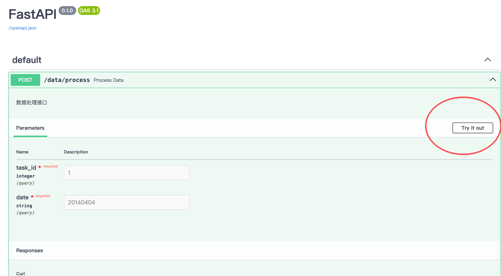
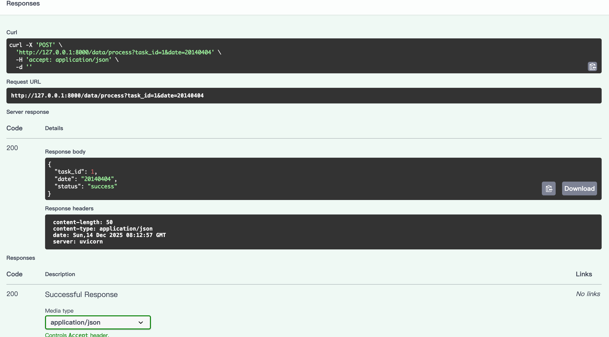

# API 有哪些类型？
1. 最常见：REST API（90% 都是这个）
2. RPC API（高级点）
3. GraphQL（再高级）

# REST API
用FastAPI + JSON 输入 + JSON 输出方式写api。
<br>
```
pip3 install fastapi uvicorn -i https://pypi.tuna.tsinghua.edu.cn/simple/
```

### 接口例子
```
from fastapi import FastAPI

app = FastAPI()

@app.post("/data/process")
def process_data(task_id: int, date: str):
    """
    数据处理接口
    """
    return {
        "task_id": task_id,
        "date": date,
        "status": "success"
    }
```
如果有人用POST方法访问/data/process,就执行上面这个函数。

### 调用接口
我们先用 Swagger（FastAPI 自带）。

打开浏览器输入：`http://127.0.0.1:8000/docs`<br>
点击/data/process。<br>
点击点 Try it out。<br>

