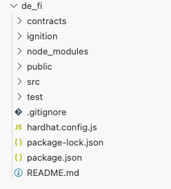

# 创建项目
下列内容是创建React项目的代码：
```bash
npx create-react-app@latest my-app
```
# 项目结构：
```
my-app/
>node_moudules
>public/index.html
>src/App.js,index.js
```
public里面是页面所在的地方，src里面是定义组件、入口文件所在的地方。

一般要修改直接修改App.js。

index.html关键内容如下：
```
  <body>
    <div id="root"></div>
  </body>
```
index.js（入口文件）长这样：
```
const root = ReactDOM.createRoot(document.getElementById('root'));
root.render(
  <React.StrictMode>
    <App />
  </React.StrictMode>
);
```
root跟index.html里面的div绑定起来了。`<App />`组件会渲染到div标签里面。`<App />`组件在App.js里面定义。

App.js长什么样：
```
function App() {
  return (
    <div className="App">
      <h1>It's just a test</h1>
    </div>
  );
}

export default App;
```
弄简单的，index.js里面的APP组件就是这个，
页面看起来是怎么样？


删掉的默认的页面是这样：


# 与Hardhat一起用
创建react项目的时候已经生成了package.json等文件了，就不再需要输入npm init -y。这些命令在react项目根目录下输入，即my-app/目录。
## 直接下载hardhat：
```bash
npm install --save-dev hardhat
```
查看一下hardhat版本：
```
npx hardhat --version
```
输出
```
2.22.19
```
## 初始化项目
```
npx hardhat init
```
输入后会出现一些选择，直接按Enter，一直按。现在目录变成这样：


多了contracts等文件夹。
