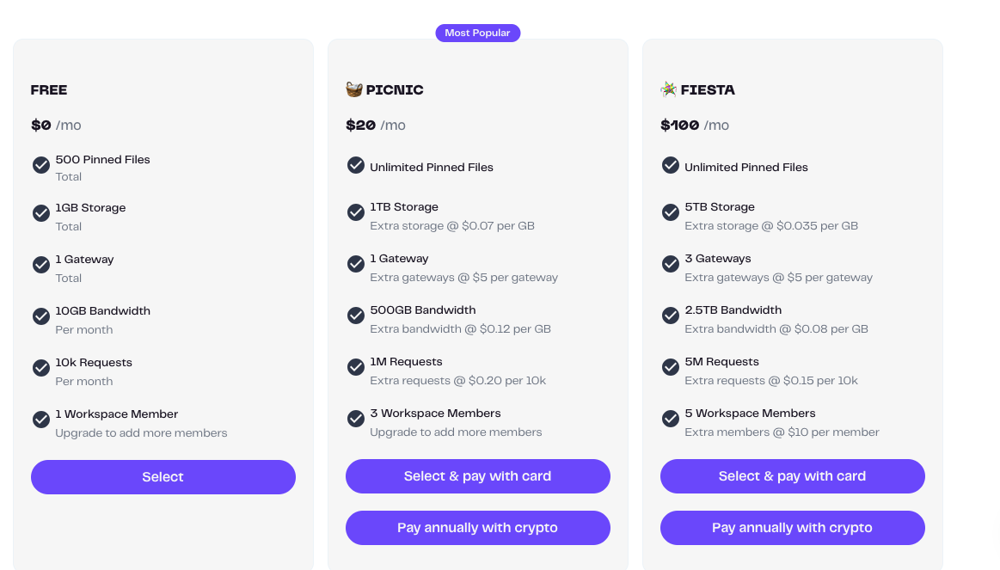
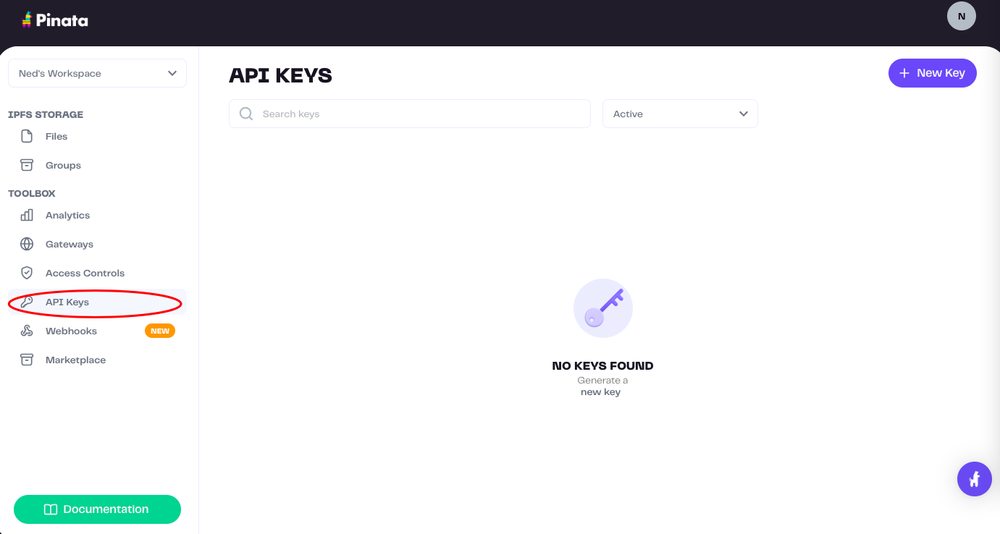
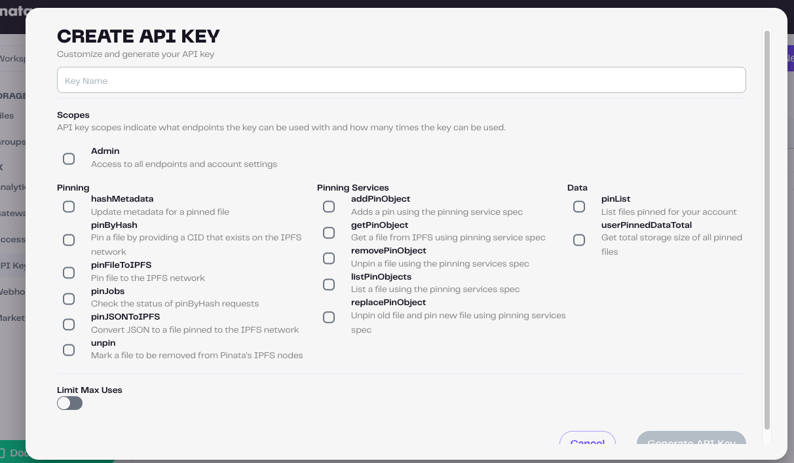
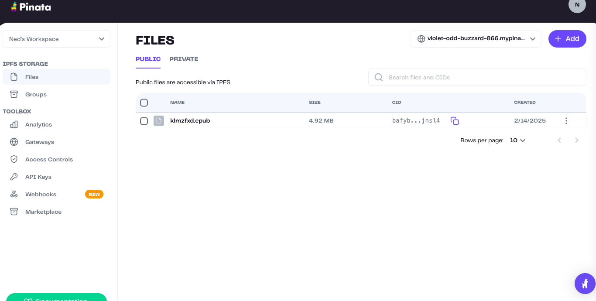
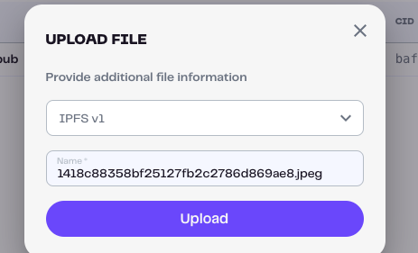
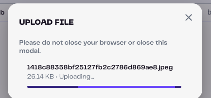
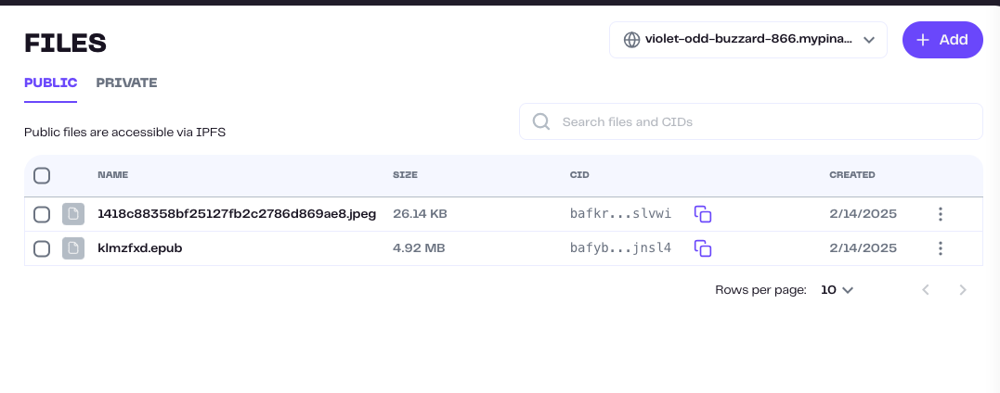
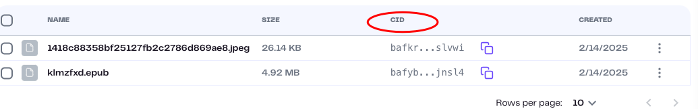

# 1. 创建Pinata账户
● 访问 Pinata官网 注册一个账户。
● 完成注册后，进入 API Keys 页面，生成一个 API 密钥（API Key）。

点击创建New Key

key name要自己写，随便什么。
创建之后会出现一个条目

# 2.上传文件
可以直接在Files界面上传。

选择好文件之后，出现

上传

之后就可以了

# 3.访问文件
通过：https://gateway.pinata.cloud/ipfs/cid
这样的形式访问。cid在Files页面有。

例如在浏览器输入：
https://gateway.pinata.cloud/ipfs/bafkreigpbp3dp65f4qiwrrh256apuoehtyajmh3dmqvcftkp7whpwslvwi
会出现图片内容。

# 4.套餐解释
你看到的 **Free** 套餐是他们的免费计划，下面是对该套餐的详细解释：

### 1. **500 Pinned Files**
   - **什么是Pinned Files？**
     在 IPFS 中，**pinning** 是指将文件保存在IPFS网络中的一个或多个节点上，确保这些文件不会因为节点垃圾回收而被删除。`Pinned Files` 就是你上传到 Pinata 并且指定保持在 IPFS 网络中的文件数量。
   - **500个限制**：免费计划每个月允许最多 **500个文件** 被“pin”到IPFS上，超过这个限制，你需要升级到更高的套餐。

### 2. **1GB Storage**
   - **1GB存储**：这是指你在 Pinata 上可以存储的数据总量。在免费套餐中，你的存储空间限制为 **1GB**。也就是说，上传的文件总大小不能超过 1GB。
   - 如果你上传的文件大小超过1GB或存储的文件总大小超过1GB，你需要考虑删除不再需要的文件或升级套餐。

### 3. **1 Gateway**
   - **1个网关**：IPFS 使用网关来访问存储在 IPFS 网络上的文件。网关是一个 HTTP 接口，它允许你通过 URL 来访问文件，而不需要直接连接到IPFS网络。
   - 在 **免费计划** 中，你有 **1个网关**，意味着你可以用一个IPFS网关来访问你上传的文件。如果你需要更多的网关（例如为多个应用提供服务），你可以升级到更高的套餐。

### 4. **10GB Bandwidth (每月)**
   - **10GB带宽**：这是指每月允许的文件传输总量，即其他人访问你上传的文件时消耗的带宽。如果你上传的文件被频繁访问并且传输总量超过10GB，你需要升级套餐，或者考虑减少文件访问频率。
   - **带宽消耗**：例如，如果你上传了一个文件，每次有人访问这个文件就会消耗带宽。如果一个文件被频繁访问，你可能会很快达到10GB的带宽限制。

### 5. **10K Requests (每月)**
   - **10,000次请求**：这是指每月可以向 Pinata 的API发起的请求次数。每次你上传、删除、或管理文件时，都会消耗一个请求。
   - 如果你的应用程序需要大量的API调用来操作文件或进行集成，那么需要注意这个限制。一旦超过10,000次请求，你会收到限制，必须升级套餐。

### 6. **1 Workspace Member**
   - **1个工作区成员**：在 Pinata 上，你可以将文件组织到工作区（Workspace）中，并与团队成员一起协作。免费套餐只允许 **1个工作区成员**，也就是说，只有你自己能使用该工作区。如果你想和其他人一起协作，你需要升级套餐，增加更多成员。

### 7. **Upgrade to Add More Members**
   - 如果你需要让团队中的其他人也能够访问或管理你的工作区，**升级到更高的套餐** 就是必要的。在免费套餐中，只允许一个人使用工作区，升级后可以增加更多成员。

---

### **总结**
**免费套餐**（Free）是 Pinata 的入门级计划，适合个人用户或小型项目，具有以下主要限制：
- 500个“pin”文件（这 500个文件 是指你可以 pin 的文件数量，并不涉及文件的大小。也就是说，即使文件的大小非常大，只要它是一个文件，它就算作一个“pin”文件。）
- 1GB 存储空间
- 10GB 的每月带宽
- 10,000 次 API 请求
- 只能有一个工作区成员

如果你上传的文件不多、访问频率不高，免费套餐就可以满足基本需求。但是如果你有更多的文件需要存储、更高的带宽需求或想要与团队协作，你可能需要升级到更高的套餐。

# Note
可以用它来分享文件，上传文件之后，通过一个链接+cid就可以通过浏览器访问，不需要科学上网，这就很方便。但是它免费套餐可能限制比较多。